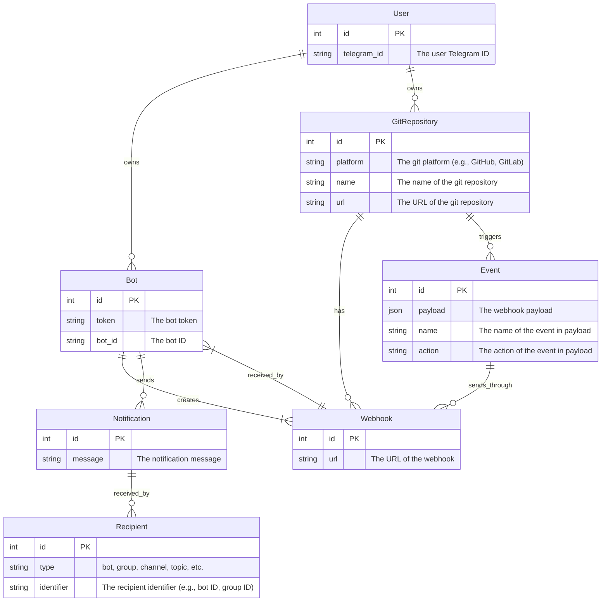
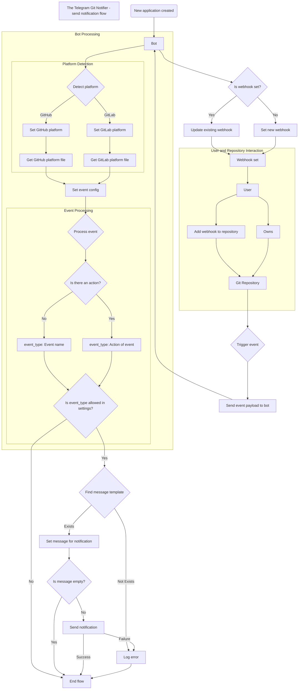

# Send Notification Flow - The Telegram Git Notifier Package

This document describes the flow of sending notifications in the Telegram Git Notifier package.

## Handle the webhook and send a notification

### The user adds this bot URL to the git repository webhook

The user adds the bot URL to the git repository webhook. The bot URL is the URL of the bot server.

Example: `https://localhost:8000/telegram-git-notifier/`

### The git repository sends a webhook to the bot

The git repository sends a webhook to the bot if any event occurs. The webhook contains the event details.

### The bot processes the webhook message

When an application receives a webhook message from the git repository, the bot processes the webhook message.
It checks if the webhook is set or not. If the event has any actions and the event is allowed notify in the settings,
etc.

### The bot gets the message details if the event is valid

If the event/action is valid, the bot will get the message details of this event/action and set the message details to
the message
object.

### The bot sends a notification

The bot sends a notification with the message details of the event to the user, group, or channel.

## Sending notifications to multiple recipients

If the bot supports sending notifications to multiple users, groups, or channels, it will manage this process. This
could involve iterating over a list of recipients, handling individual user preferences, etc.

## Packages

This flow is implemented in two packages: `telegram-git-notifier` and `laravel-telegram-git-notifier`.

### telegram-git-notifier

This package handles the core functionality of receiving and processing webhooks from GitHub and GitLab, and sending
notifications to Telegram.

### laravel-telegram-git-notifier

This package is a Laravel wrapper for the `telegram-git-notifier` package. It provides a Laravel-friendly way to use
the `telegram-git-notifier` functionality, including configuration and views for customizing the notifications.

## Entity Relationship Diagram

> [!NOTE]
> The following diagram is a simplified version of the entity relationship diagram for the Telegram Git Notifier.
>
> The data is **still saved in JSON format**. I don't use database storage because I don't want to **affect any data on
your real system**. Its purpose is only to clarify the feature's operating model.



## Send notification flowchart

Here is the flowchart of the Telegram Git Notifier - send notification flow:



## Code flow

Here is the code flow of the Telegram Git Notifier - send notification flow:

```plaintext
Receive webhook from git repository
    → packages/laravel-telegram-git-notifier/src/Http/Actions/IndexAction::class
        - Check query type (callback_query, message, webhook[gitlab, github])
        ∟ create new NotificationService
            - call the handle method of the NotificationService
        
        → packages/laravel-telegram-git-notifier/src/Services/NotificationService@handle
            - Get and set the event from the request in handleEventFromRequest method
            - Call the sendNotification method
            
            → packages/telegram-git-notifier/src/Trait/EventTrait@handleEventFromRequest
                - Set event name
                - Check and update platform(GitLab, GitHub) for event object
                
                → Go to setPlatFormForEvent method
                    - Detech and set platform file
                    - Update event config from the platform file
                    
            → Go to sendNotification method of this NotificationService
                - Call validateAccessEvent to check if the event is allowed
                - Loop through the recipients and send the notification to each recipient
                
                → packages/telegram-git-notifier/src/Services/NotificationService@validateAccessEvent
                    - Set payload and message from the event
                    - Check if the event is allowed in the settings
                    - Check if the event/action is allowed in the platform settings
            
                → packages/telegram-git-notifier/src/Structures/Notification@sendNotify
```
