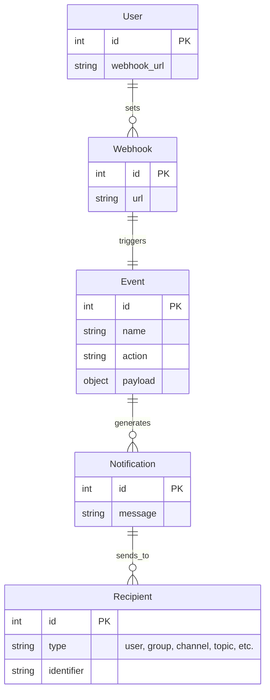

# The Telegram Git Notifier flow

This document describes the flow of the telegram git notifier.

## Handle the webhook and send a notification

### The user adds this bot URL to the git repository webhook

The user adds the bot URL to the git repository webhook. The bot URL is the URL of the bot server.

### The git repository sends a webhook to the bot

The git repository sends a webhook to the bot if any event occurs. The webhook contains the event details.

### The bot processes the webhook message

The bot will receive the webhook message and process it. The bot will check the validity of the webhook message.

### The bot gets the message details if the event is valid

If the event is valid, the bot will get the message details of this event and set the message details to the message object.

### The bot sends a notification

The bot sends a notification with the message details of the event to the user, group, or channel.

## Sending notifications to multiple users

If the bot supports sending notifications to multiple users, groups, or channels, it will manage this process. This could involve iterating over a list of recipients, handling individual user preferences, etc.

## Packages

This flow is implemented in two packages: `telegram-git-notifier` and `laravel-telegram-git-notifier`.

### telegram-git-notifier

This package handles the core functionality of receiving and processing webhooks from GitHub and GitLab, and sending notifications to Telegram.

### laravel-telegram-git-notifier

This package is a Laravel wrapper for the `telegram-git-notifier` package. It provides a Laravel-friendly way to use the `telegram-git-notifier` functionality, including configuration and views for customizing the notifications.

## Future Work

In the future, additional flows will be implemented to handle other aspects of the bot's functionality, such as error handling, customizing notifications, and sending notifications to multiple users.

